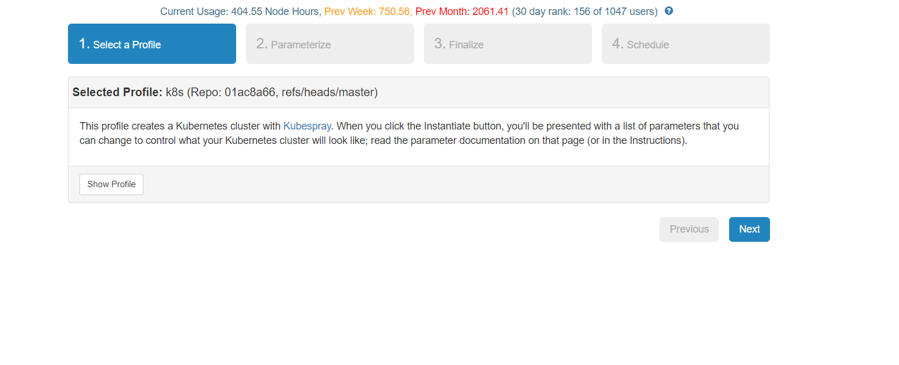
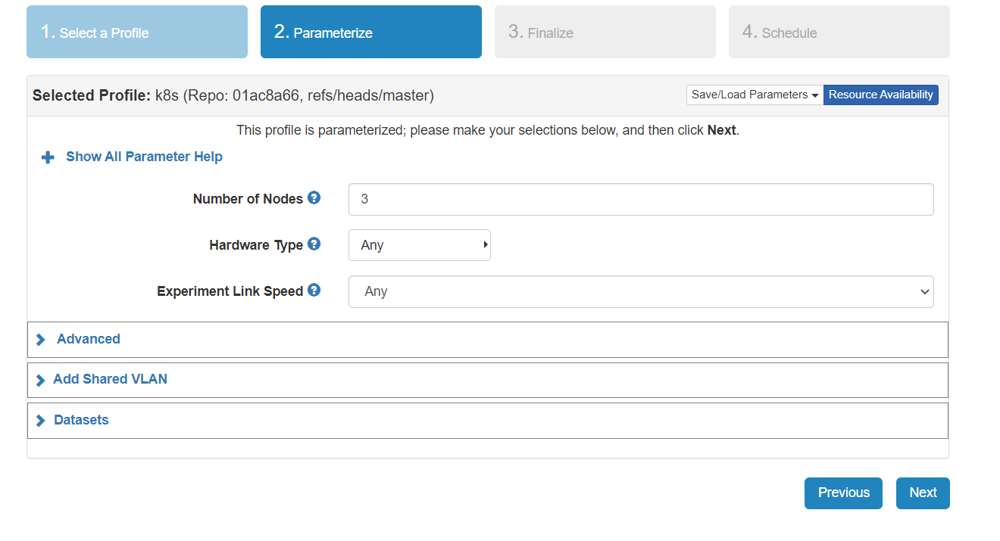
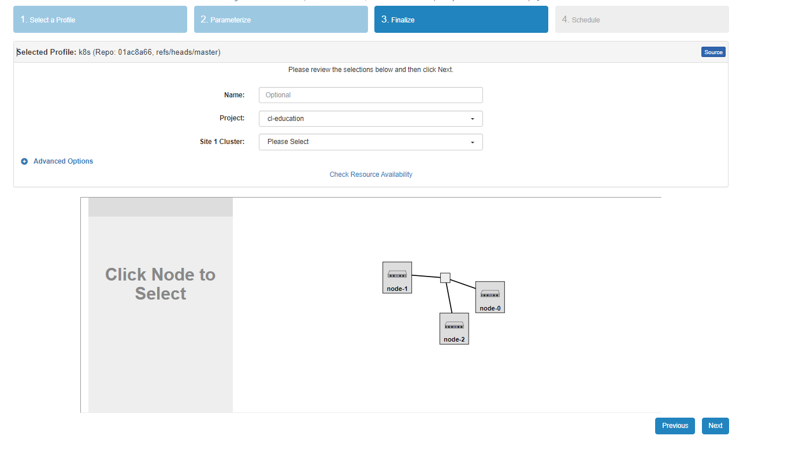
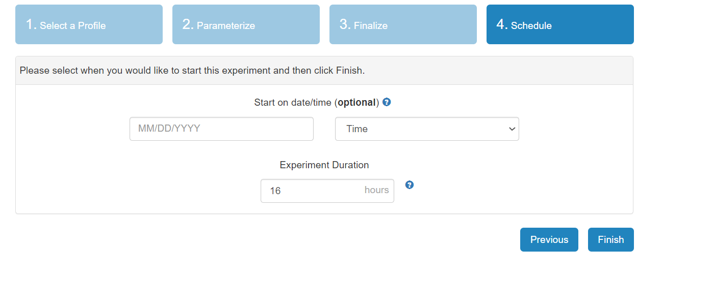
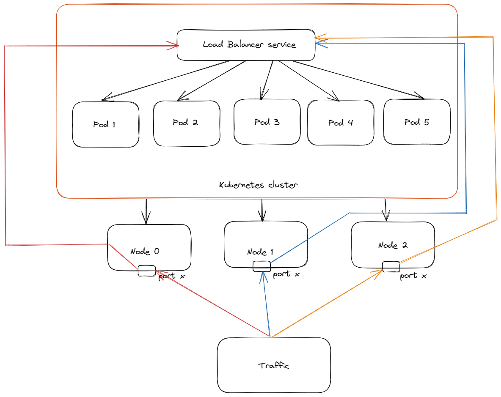
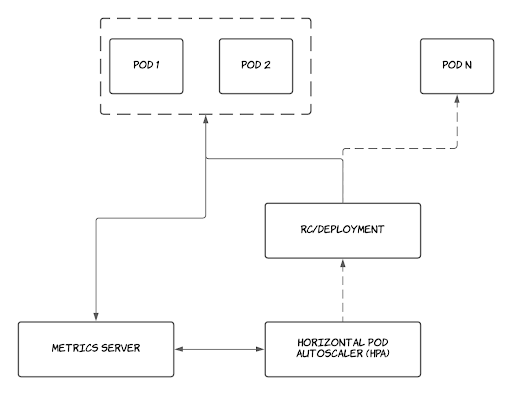

## Exercise : Reserve resources on Cloud-Lab

To run an experiment on cloud-lab you need to follow the following steps:

-   Select a profile which is relevent to your experiment, here for our experiment we have to select k8s.

-   Instantiate the profile and wait for the resources to come up.

-   Log in to the resources and run your experiment.

### Open and Instantiate profile

For this experiment we will be using the following profile : https://www.cloudlab.us/instantiate.php?profile=79d0f735-a099-11ea-b1eb-e4434b2381fc

Once you click on the link it will take to the landing page which would look similar to this and contains a brief description of the profile :



Click on Next and you will see a page similar to the image below. Here you have to select parameters for our experiment. You don't need to make any changes here since everything selected by default is enough for the present experiment. make sure that the parameters are same as shown in the image.



click on Next and this will take to a Finalize section where we have to select the cluster. For our experiment use of any of the cluster is fine. Make sure to select the cluster which has resources available to use. To check the resources click on "Check Resource Availability".



Click on Next in Finalize section and it will take to the Schedule section. Here select the number of hours you are going to use the profile. for our experiment 16 hours is enough and if needed extra it can be extened.



Click Finish and the profile will start to intantiate, the process will take close to 30 mins and once done you will get a mail saying "Kubernetes Instance Setup Complete". This means that the resources are ready to use and you can login. Since Kubernetes is based on the concept of master and worker node and here in our experiment node-0 and node-1 are master nodes you can login to anyof them and start working.

## Exercise: Deploy an image classification app on cloud.

For this exercise we will use a flask app to deploy the food classification model you build in lab 8.

To download the content of the app clone this repository "https://github.com/teaching-on-testbeds/k8s-ml" or run the following command in your terminal.

``` shell
git clone https://github.com/indianspeedster/Deploy_flask.git
```

The content of the repository contains everything but the model which you want to deploy so now we will transfer the model from your local host to remote host.

``` shell
scp "path of saved model" "name of remote host":"/users/{username}/Deploy_flask/"
```

Now we have our model which we are going to deploy.

Before going ahead make sure that the folder structure is same as in the picture below


Now we are ready to run the flask app, before that you should check what is the public ip from which the content of the app can be accessed.

``` shell
$ curl ifconfig.me
```

The output of this command is the public ip of our remote host.

We will be using Docker to containerise the ml-app. Learning Docker is a large process and that is not the part of this exercise. To make sure that you don't get stuck with docker, a Dockerfile is already provided in the repository you cloned.

Before we move ahead let's check if we have docker installed in our system.

``` shell
$ docker -v
```

The output should be similiar to

``` shell

Docker version 19.03.15, build 99e3ed8919
```

The next step is to get into ks8-ml directory

``` shell
$ cd Deploy_flask
```

Next step is to create a docker image of our flask app and push it to the local registry running at 10.10.1.1:5000

``` shell

$ docker build -t my-app:0.0.1 .
$ docker tag my-app:0.0.1  10.10.1.1:5000/my-app:0.0.1
$ docker push 10.10.1.1:5000/my-app:0.0.1
```

Now our docker image is build and is available to use, we can use it any number of time and concurrently on different ports

For instance we let's run a docker container on port 32001

``` shell
$ docker run -d -p 32001:5000 10.10.1.1:5000/my-app
```

-   -d is for detach mode.
-   -p is to assign the port host_port:container_port.

Get the public ip of your host, go to your browser and run {public_ip}:32001, you will see that your app is up and running there.

This exercise is complete here.

## Exercise 2: Deploy an image classification App on a kubernetes Pod.

Before going ahead first let's understand what is kubernetes.

**Kubernetes** is an open-source container orchestration platform that automates the deployment, scaling, and management of containerized applications. It was originally developed by Google and is now maintained by the Cloud Native Computing Foundation (CNCF).

**Key Features**

-   *Automated deployment and scaling:* Kubernetes automates the deployment and scaling of containerized applications, making it easier to manage and scale complex microservices architectures.
-   *Self-healing:* Kubernetes monitors the health of your applications and automatically restarts or replaces containers if they fail or become unresponsive.
-   *Service discovery and load balancing:* Kubernetes provides built-in service discovery and load balancing, making it easier to manage the networking aspects of your applications.
-   *Rolling updates and rollbacks:* Kubernetes supports rolling updates and rollbacks, allowing you to deploy updates to your applications without downtime.
-   *Config management:* Kubernetes provides built-in support for managing configuration files and secrets, making it easier to manage the configuration of your applications.
-   *Resource management:* Kubernetes allows you to set resource limits and requests for your applications, ensuring that they have the resources they need to run properly.

**Pods** : Pods are a fundamental building block in Kubernetes and are used to deploy and manage containerized applications in a scalable and efficient way.They are designed to be ephemeral, meaning they can be created, destroyed, and recreated as needed. They can also be replicated, which allows for load balancing and high availability.

Since, Kubernetes is a Container Orchestration platform so we need containers to go ahead with deploying an application on kubernetes. Here in our execise we will be using Docker container.

In our cluster node-0 is the master node so we will SSH into node-0

``` shell
$ ssh cspandey@pc827.emulab.net
```

Next step is to get all the code into our remote host which will be used to deploy the application.

To download the content of the app clone this repository "https://github.com/teaching-on-testbeds/k8s-ml" or run the following command in your terminal.

``` shell
$ git clone https://github.com/indianspeedster/ml_app_on_ks_pod.git
$ cd ml_app_on_ks_pod
```

Now we have everything which we are going to need to deploy our app, the last thing we need to check is weather kubernetes and Docker is installed or not.

To check kubernetese version :

``` shell
$ kubectl -v
```

To check Docker version :

``` shell
$ docker -v
```

In the repository you will see there is a file named *Dockerfile*, this file will be used to create a docker image which further will be pulled by kubernetes pods.

to create a docker image run the following command in the shell also make sure that you are in the food_classification directory.

``` shell
$ docker build -t my-app:0.0.2 .
```

Now Docker image is ready, we can check the same by running the following command:

``` shell
$ docker images
```

Next step is to push the docker image to the docker registry which is accessible from the kubernetes cluster. The docker resistry is on 10.10.1.1:5000

First we will tag the image, run the command below to do the same:

``` shell
$ docker tag my-app:latest  10.10.1.1:5000/my-app:0.0.2
```

Next we will push the image to the registry:

``` shell
$ docker push 10.10.1.1:5000/my-app:0.0.2
```

To make things simple and easy all our deployments would be done through a manifest file deployment.yaml .

To check the content of deployment.yaml file, enter the following commands on your teminal:

``` shell
$ cat pod_deployment.yaml
```

compare the content of the file to make sure that you have loaded the correct file.

``` shell
$ cat pod_deployment.yaml

apiVersion: v1
kind: Service
metadata:
  name: flask-test-service
spec:
  selector:
    app: flask-test-app
  ports:
  - protocol: "TCP"
    port: 6000
    targetPort: 5000
    nodePort: 32000
  type: NodePort


---
apiVersion: apps/v1
kind: Deployment
metadata:
  name: flask-test-app
spec:
  selector:
    matchLabels:
      app: flask-test-app
  replicas: 1
  template:
    metadata:
      labels:
        app: flask-test-app
    spec:
      containers:
      - name: flask-test-app
        image: 10.10.1.1:5000/my-app:0.0.2
        imagePullPolicy: Always
        ports:
        - containerPort: 5000
```

The last and final step is to apply the content of the deployment.yaml file. run the command below to do so:

``` shell
$ kubectl apply -f pod_deployment.yaml
```

If the output looks similar to this

``` shell
service/flask-test-service created
deployment.apps/flask-test-app created
```

Then it means your deployment is successfull.

Since the content of our pod is large so it will take close to a minute for the pod to start running.

To check the status of pod run the below mentioned command:

``` shell
$ kubectl get pods -o wide
```

if the status of pods shows as Running then it means the pod is healthy and is running.

Since our pod is running on the cluster via a service, we also need to check the status of the service. To check run the command:

``` shell
$ kubectl get svc -o wide
```

In the output you will see the nodeport number, it is the same port number on which the app is running.

Next go to your browser and run ip of any of the nodes colon node port, eg: 192.168.56.453:32000 and you will see that your ml app is up and running, try predicting and hae fun ...!

## Exercise 3: Scaling a ML-app (Part-1)

Last exercise, we deployed a ML app on kubernetes pod, and we saw that the app was working fine, but what will happen if a lot of traffic comes to the app? The single web service soon becomes overwhelmed, causing slow response times and even downtime. To fix this problem what we can do is create multiple pods and evenly distribute the traffic on each of the pod and this process of evenly distributing traffic on the pods is known as **Load balancing**.

In this exercise our core focus will be to understand and implement the concept of **Load Balancing**.

Load balancing in a Kubernetes cluster involves distributing incoming network traffic across multiple instances of a particular application, service or pod. This is done using a load balancer that sits in front of the application instances or pods and distributes traffic to each of them based on a set of rules or algorithms. Here in our case our load balancer will be using Round Robin algoritm to distribute traffic.

The diagram below shows how exactly traffic flows in a load balancer.



The core idea is that you have multiple pods running and the traffic is always redirected to the pod which is not busy and is least utilized.

Let's see a demo to verify that the response always comes from a different pod.

ssh into node-0

``` shell
$ ssh cspandey@pc827.emulab.net
```

create a directory load_balancing_demo

``` shell
$ mkdir load_balancing_demo
$ cd load_balancing_demo
```

Get a sample deployment.yaml file that can be used to deploy a load balancer as service.

``` shell
$ wget https://github.com/indianspeedster/deploy_loadbalancer.yaml
```

Deploy load balancer as a service.

``` shell
$ kubectl apply -f deploy_loadbalancer.yaml
```

The command above will deploy 5 replicas of a simple flask app which return output as hello user from "pod_name". pod_name is the name of the pod from which the user is getting a response.

got to your web browser and enter public ip of any of your node and port 32000, you will get a response.

To see all the pods running you can run the command:

``` shell
$ kubectl get pods
```

You can match the pod_name with the pod from which you are getting response.

Also, to check that at a specific time how much cpu memory a pod is using, run the command:

``` shell

$ kubectl top pods
```

So, Now we understood that how exactly load balancing work.

Next step will be to deploy a ML app with a load balancer.

The steps will be similar with what we did in exercise 2. the only difference is that now we will be using a seperate deployment.yaml file which will specify that we will be creating 5 different replicas of the same ml app on 5 seperate pods.

Clone the repository that contains the the Flask ML app to your remote:

``` shell
$ git clone https://github.com/teaching-on-testbeds/k8s-ml-lb.git
```

get inside the repository:

``` shell
$ cd k8s-ml-lb
```

get your ml model from your local through scp and make sure that the model is named as ml-lb.h5

Create a docker image for the ml-app by using the command.

``` shell
$ docker build -t --no-cache ml-app:latest .
```

Tag the docker image to push it to the local registry

``` shell
$ docker tag ml-app:latest  10.10.1.1:5000/ml-app:latest
```

Push the image to the registry:

``` shell
$ docker push 10.10.1.1:5000/ml-app:latest
```

The last task is to launch the scaled ML application by utilizing a load balancer that has a static scaling configuration of five pods.

On your remote terminal run:

``` shell
$ kubectl apply -f deployment_lb.yaml
```

To check if the deployment is running fine after 2 mins run

``` shell
$ kubectl get pods
```

If the status of all pods says as "Running" this means that the pods are healthy and running fine.

open your browser and run ip:32000 (here ip is the public ip of any of your nodes) and you can see that your ml app is up and running try making predictions.

**Testing Load balancing**

*Content to be added*

## Exercise 3: Scaling a ML-app (Part-2)

In last exercise we used Load balancing to distribute incoming traffic across multiple instances of a particular application running on 5 different pods. The benefit was that in case we have heavy traffic the traffic can be distributed evenly and our service won't be affect. But what if there is a time when the traffic goes down and it can be easily handeled with one pod. in that case the other pods won't be used and the existing resources are not getting used efficiently. To fix this issue we use Horizontal scalling.

**Horizontal Scalling** is a process of adding number of instances of an application or service to handle increasing level of traffic or workload.

Here in our exercise we will be using a widely used horizontal scalling mechanism called *Horizontal Pod Autoscalling(HPA)* provided by kubernetes. The reason why we are using HPA is because HPA scales up or down the number of pods to ensure that the application has enough resources to handle the traffic.

The flow chart below demonstrates the working of HPA.



source: https://granulate.io/blog/kubernetes-autoscaling-the-hpa/

To deploy an ML-App with Horizontal pod Auto scaller, We need to add a new resource in our manifest file of kind *HorizontalPodAutoscaler* and make some changes in resource section of deployment and set the limits and requests for cpu usage. Manifest file is already made for this exercise, so you don't need to worry much about that.

Clone the repository that contains the Flask ML app and other files for Horizontal scalling:

``` shell
$ cd ~/
$ git clone https://github.com/teaching-on-testbeds/k8s-ml-hs.git
$ cd k8s-ml-h5
```

Get your ml model from your local to the same folder through scp.

Create a docker image for the ml-app by using the command.

``` shell
$ docker build -t --no-cache ml-app-hs:latest .
```

Tag the docker image to push it to the local registry

``` shell
$ docker tag ml-app-hs:latest  10.10.1.1:5000/ml-app-hs:latest
```

Push the image to the registry:

``` shell
$ docker push 10.10.1.1:5000/ml-app-hs:latest
```

Understanding the manifest file:

Run this command to see the manifest file

``` shell
$ cat deployment_hs.yaml
```

Here you can see that there are three kind of resources :

-   HorizontalPodAutoscaler :- This creates the horizontal pod autoscaler
-   Service :- This creates a service which is used to redirect tcp requests on in between pods and nodes.
-   Deployment :- This creates a deployment of our flask app on a single pod with cpu limits to track the uses of cpu.

Now we will use this manifest file to deploy our app.

On your terminal run:

``` shell
$ kubectl apply -f deployment_hs.yaml
```

Now our ml-app is deployed with horizontal scalling.

To check the healt of pods run

``` shell
$ kubectl get pods
```

if the status shows as running, the pods are healthy.

Initially you will see that there is only one pod running, but with time when the traffic increases the pods will scale up and when the traffic goes down the pods will scale down.

**Testing Horizontal Scalling** TO - DO
<hr>

<small>Questions about this material? Contact Fraida Fund</small>

<hr>

<small>This material is based upon work supported by the National Science Foundation under Grant No. 2231984 and Grant No. 2230079.</small>
<small>Any opinions, findings, and conclusions or recommendations expressed in this material are those of the author(s) and do not necessarily reflect the views of the National Science Foundation.</small>
