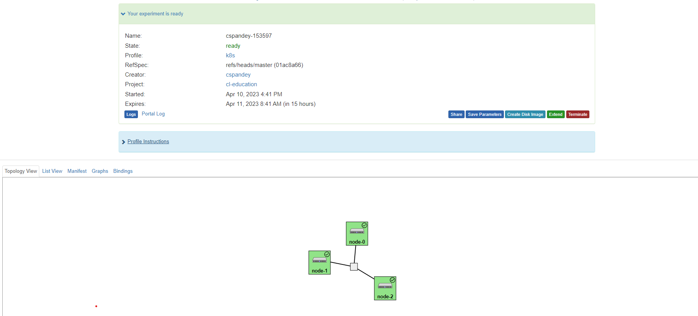
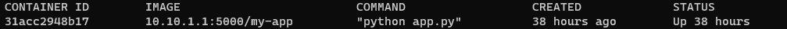

## Exercise : Reserve resources on Cloud-Lab

To run an experiment on cloud-lab you need to follow the following steps:

-   Select a profile which is relevent to your experiment, here for our experiment we have to select k8s.

-   Instantiate the profile and wait for the resources to come up.

-   Log in to the resources and run your experiment.

### Open and Instantiate profile

For this experiment we will be using the following profile : https://www.cloudlab.us/instantiate.php?profile=79d0f735-a099-11ea-b1eb-e4434b2381fc

Once you click on the link it will take to the landing page which would look similar to this and contains a brief description of the profile :


Click on Next and you will see a page similar to the image below. Here you have to select parameters for our experiment. You don't need to make any changes here since everything selected by default is enough for the present experiment. make sure that the parameters are same as shown in the image.


click on Next and this will take to a Finalize section where we have to select the cluster. For our experiment use of any of the cluster is fine. Make sure to select the cluster which has resources available to use. To check the resources click on "Check Resource Availability".


Click on Next in Finalize section and it will take to the Schedule section. Here select the number of hours you are going to use the profile. for our experiment 16 hours is enough and if needed extra it can be extened.


Click Finish and the profile will start to intantiate, the process will take close to 30 mins and once done you will get a mail saying "Kubernetes Instance Setup Complete". This means that the resources are ready to use and you can login.

Once the Process is complete the final page will look similar to this, where all three nodes have a tick on them as shown in the image below.



Since Kubernetes is based on the concept of master and worker node and here in our experiment node-0 and node-1 are master nodes you can login to any of them and start next exercises.

This exercise is done here.

## Exercise: Deploy an image classification app on cloud.

For this exercise we will use a flask app to deploy the food classification model you build in lab 8.

To download the content of the app run the following command in your terminal.

``` shell
git clone https://github.com/teaching-on-testbeds/k8s-ml.git
```

The content of the repository contains everything but the model which you want to deploy so now we will transfer the model from your local host to remote host. Make sure that your model is named as "model.h5"

``` shell
scp "path of saved model" "name of remote host":"/users/{username}/app/"
```

After transfering the file again log in to node-0.

Now we are ready to run the flask app, before that you should check what is the public ip from which the content of the app can be accessed.

``` shell
curl ifconfig.me
```

The output of this command is the public ip of our remote host.

We will be using Docker to containerise the ml-app. Learning Docker is a large process and that is not the part of this exercise. To make sure that you don't get stuck with docker, a Dockerfile is already provided in the app you downloaded.

Before we move ahead let's check if we have docker installed in our system.

``` shell
docker -v
```

The output should be similiar to

``` shell

Docker version 19.03.15, build 99e3ed8919
```

The next step is to get into app directory which contains flask app

``` shell
cd k8s-ml/app
```

Before going ahead make sure that the folder structure is same as below

-   app
    -   instance
    -   static
    -   templates
    -   app.py
    -   Dockerfile
    -   requirements.txt
    -   model.h5

Next step is to create a docker image of our flask app and push it to the local registry running at 10.10.1.1:5000

``` shell

docker build -t --no-cache my-app:0.0.1 .
docker tag my-app:0.0.1  10.10.1.1:5000/my-app:0.0.1
docker push 10.10.1.1:5000/my-app:0.0.1
```

Now our docker image is built and is available to use, we can use it any number of time and concurrently on different ports. In all future exercises we will be using the same docker image.

For instance we let's run a docker container on port 32001

``` shell
docker run -d -p 32001:5000 10.10.1.1:5000/my-app:0.0.1
```

-   -d is for detach mode.
-   -p is to assign the port host_port:container_port.

Get the public ip of your host, go to your browser and run {public_ip}:32001, you will see that your app is up and running there.

Try doing some predictions.

Once you are done using the container, You can stop it by following the steps mentioned:

First you need to get CONTAINER ID, it can be obtained by running

``` shell
docker ps
```

The output will be similar to the image below:



copy the CONTAINER ID of your container and run

``` shell
docker stop CONTAINER ID<>
```

Here for our experiment, you may need to change the classification model, once you change it you need to rebuild the conatiner to make sure that the changes are reflecting in container.

To rebuild the container follow the same step as you did above while building the container for the first time.

``` shell

docker build -t --no-cache my-app:0.0.1 .
docker tag my-app:0.0.1  10.10.1.1:5000/my-app:0.0.1
docker push 10.10.1.1:5000/my-app:0.0.1
```

In future exercises too you need to follow the same process to rebuild a container.

This exercise is complete here.

## Exercise 2: Deploy an image classification App on a kubernetes Pod.

Before going ahead first let's understand what is kubernetes.

**Kubernetes** is an open-source container orchestration platform that automates the deployment, scaling, and management of containerized applications. It was originally developed by Google and is now maintained by the Cloud Native Computing Foundation (CNCF).

**Key Features**

-   *Container Orchestration:* Kubernetes helps to automate the deployment, scaling and management of applications that are containerized. it also helps to manage containers and their interdependency.

-   *Self-healing:* If any containers fail, kubernetes can automatically detect it and replace it with a fully functional container and make sure that the application is always available and running.

-   *Service discovery and load balancing:* Kubernetes provides a built-in service discovery mechanism which helps containers to find other containers running inside the cluster and communicate with each other, even as they are dynamically created and destroyed. So, everytime a new container comes up, we don't need to network the same with other containers but it by default gets networked. Kubernetes also have a built-in load balancing mechanism that can distribute traffic across multiple instances of your application. In next exercise we will be implementing load balancing on our app.

-   *Resource management:* Kubernetes allows you to set resource limits and requests for your applications, ensuring that the application have the resources to run efficiently. we will see the implementation of this in exercise 4 where we limit the cpu usage by 40%.

**Pods** : Pods are the basic components in Kubernetes and are used to deploy and manage containerized applications in a scalable and efficient way.They are designed to be ephemeral, meaning they can be created, destroyed, and recreated as needed. They can also be replicated, which allows for load balancing and high availability.

Since, Kubernetes is a Container Orchestration platform so we need containers to go ahead with deploying an application on kubernetes. Here in our execise we will be using Docker container.

In our cluster node-0 is the master node so we will log into node-0.

To deploy an app on a kubernetes cluster we need a manifest file. We have the manifest in the folder deploy_k8s named as deployment_k8s.yaml , lets go to the folder :

``` shell

cd ~/k8s-ml/deploy_k8s
```

Next let's understand what is there in the deployment_k8s.yaml file.

``` shell
cat deployment_k8s.yaml
```

The output will look like this:

``` shell
apiVersion: v1
kind: Service
metadata:
  name: flask-test-service
spec:
  selector:
    app: flask-test-app
  ports:
  - protocol: "TCP"
    port: 6000
    targetPort: 5000
    nodePort: 32000
  type: NodePort

---
apiVersion: apps/v1
kind: Deployment
metadata:
  name: flask-test-app
spec:
  selector:
    matchLabels:
      app: flask-test-app
  replicas: 1
  template:
    metadata:
      labels:
        app: flask-test-app
    spec:
      containers:
      - name: flask-test-app
        image: 10.10.1.1:5000/my-app:0.0.1
        imagePullPolicy: Always
        ports:
        - containerPort: 5000
```

Here, the manifest file defines a kubernetes service with name flask-test-service and a kubernetes deployment named flask-test-app.

In the service you can see the ports are defined on which the app will be served. Port is the port of the cluster, targetPort is the port of container and nodePort is the port of the three nodes.

In the deployment flask-test-app you have a container which will pull the docker image 10.10.1.1:5000/my-app:0.0.1 from the local registry, "imagePullPolicy: Always" means that the app won't be using cached image and every time the deployment is created it will pull a new image from the registry.

The last and final step is to apply the content of the deployment_k8s.yaml file. run the command below to do so:

``` shell
kubectl apply -f deployment_k8s.yaml
```

If the output looks similar to this

``` shell
service/flask-test-service created
deployment.apps/flask-test-app created
```

Then it means your deployment is successfull.

Since the content of our pod is large so it will take close to a minute for the pod to start running.

To check the status of pod run the below mentioned command:

``` shell
kubectl get pods -o wide
```

if the status of pods shows as Running then it means the pod is healthy and is running.

Since our pod is running on the cluster via a service, we also need to check the status of the service. To check run the command:

``` shell
kubectl get svc -o wide
```

In the output you will see the nodeport number, it is the same port number on which the app is running.

Use the below mentioned command to know the ip of your node.

``` shell
curl ifconfig.me
```

Next go to your browser and run ip of any of the nodes colon node port, eg: 192.168.56.453:32000 and you will see that your ml app is up and running, try making predictions from the app.

When you are done with your experiment, make sure to delete the deployment and service. To delete run the command:

``` shell
kubectl delete -f deployment_k8s.yaml
```

This exercise is complete.

## Exercise 3: Scaling a ML-app (Part-1)

Last exercise, we deployed a ML app on kubernetes pod, and we saw that the app was working fine, but what will happen if a lot of traffic comes to the app? The single web service soon becomes overwhelmed, causing slow response times and even downtime. To fix this problem what we can do is create multiple pods and evenly distribute the traffic on each of the pod and this process of evenly distributing traffic on the pods is known as **Load balancing**.

In this exercise our core focus will be to understand and implement the concept of **Load Balancing**.

Load balancing in a Kubernetes cluster involves distributing incoming network traffic across multiple instances of a particular application, service or pod. This is done using a load balancer that sits in front of the application instances or pods and distributes traffic to each of them based on a set of rules or algorithms. Here in our case our load balancer will be using Round Robin algoritm to distribute traffic.

The diagram below shows how exactly traffic flows in a load balancer.


The core idea is that you have multiple pods running and the traffic is always redirected to the pod which is not busy and is least utilized.

Let's see a demo to verify that the response always comes from a different pod.

ssh into node-0

To deploy an app with a load balancer we will be needing a manifest file. To file is already there in the folder deploy_lb named as deployment_lb.yaml.

``` shell
cd ~/k8s-ml/deploy_lb
```

Next let's understand what is there in the deployment_lb.yaml file.

``` shell
cat deployment_lb.yaml
```

The output will be as follow

``` shell
apiVersion: v1
kind: Service
metadata:
  name: flask-test-service
spec:
  selector:
    app: flask-test-app
  ports:
  - protocol: "TCP"
    port: 6000
    targetPort: 5000
    nodePort: 32000
  type: LoadBalancer


---
apiVersion: apps/v1
kind: Deployment
metadata:
  name: flask-test-app
spec:
  selector:
    matchLabels:
      app: flask-test-app
  replicas: 5
  template:
    metadata:
      labels:
        app: flask-test-app
    spec:
      containers:
      - name: flask-test-app
        image: 10.10.1.1:5000/my-app:0.0.1
        imagePullPolicy: Always
        ports:
        - containerPort: 5000
```

Here, the manifest file defines a kubernetes service of type LoadBalancer with name flask-test-service and a kubernetes deployment named flask-test-app.

In the service you can see the ports are defined on which the app will be served. Port is the port of the cluster, targetPort is the port of container and nodePort is the port of the three nodes.

In the deployment flask-test-app you have a container which will pull the docker image 10.10.1.1:5000/my-app:0.0.1 from the local registry, "imagePullPolicy: Always" means that the app won't be using cached image and every time the deployment is created it will pull a new image from the registry, you can see "replicas:5" which means that the deployment will create 5 replicas of the app and all will be served through the load balancer where the traffic will be divided equally.

Next step is to deploy this app with a load balancer through the help of the manifest file deployment_lb.yaml .

``` shell
kubectl apply -f deployment_lb.yaml
```

To check if the deployment is running fine after 2 mins run

``` shell
kubectl get pods
```

If the status of all pods says as "Running" this means that the pods are healthy and running fine.

open your browser and run ip:32000 (here ip is the public ip of any of your nodes) and you can see that your ml app is up and running try making predictions.

When you are done with your experiment, make sure to delete the deployment and service. To delete run the command:

``` shell
kubectl delete -f deployment_lb.yaml
```

This exercise is complete here.

## Exercise 3: Scaling a ML-app (Part-2)

In last exercise we used Load balancing to distribute incoming traffic across multiple instances of a particular application running on 5 different pods. The benefit was that in case we have heavy traffic the traffic can be distributed evenly and our service won't be affect. But what if there is a time when the traffic goes down and it can be easily handeled with one pod. in that case the other pods won't be used and the existing resources are not getting used efficiently. To fix this issue we use Horizontal scalling.

**Horizontal Scalling** is a process of adding number of instances of an application or service to handle increasing level of traffic or workload.

Here in our exercise we will be using a widely used horizontal scalling mechanism called *Horizontal Pod Autoscalling(HPA)* provided by kubernetes. The reason why we are using HPA is because HPA scales up or down the number of pods to ensure that the application has enough resources to handle the traffic.

The flow chart below demonstrates the working of HPA.


source: https://granulate.io/blog/kubernetes-autoscaling-the-hpa/

To deploy an ML-App with Horizontal pod Auto scaller, We need to add a new resource in our manifest file of kind *HorizontalPodAutoscaler* and make some changes in resource section of deployment and set the limits and requests for cpu usage. Manifest file is already made for this exercise, so you don't need to worry much about that. Manifest file is inside the folder deploy_hpa named as deployment_hpa.yaml :

``` shell
cd ~/k8s-ml/deploy_hpa
```

Let's understand this manifest file:

Run this command to see the manifest file

``` shell
cat deployment_hpa.yaml
```

The content will look similar to this :

``` shell
apiVersion: autoscaling/v1
kind: HorizontalPodAutoscaler
metadata:
  name: ml-app-hpa
spec:
  maxReplicas: 5
  minReplicas: 1
  scaleTargetRef:
    apiVersion: apps/v1
    kind: Deployment
    name: ml-app-hpa
  targetCPUUtilizationPercentage: 50
---
apiVersion: v1
kind: Service
metadata:
  name: flask-test-service
spec:
  selector:
    app: ml-app-hpa
  ports:
  - protocol: "TCP"
    port: 6000
    targetPort: 5000
    nodePort: 32000
  type: LoadBalancer
---


apiVersion: apps/v1
kind: Deployment
metadata:
  name: ml-app-hpa
spec:
  selector:
    matchLabels:
      app: ml-app-hpa
  replicas: 1
  template:
    metadata:
      labels:
        app: ml-app-hpa
    spec:
      containers:
      - name: ml-app-hpa
        image: 10.10.1.1:5000/my-app:0.0.1
        imagePullPolicy: Always
        resources:
          requests:
            cpu: 1000m
            memory: 1000Mi
          limits:
            cpu: 1000m
            memory: 1000Mi
        ports:
        - containerPort: 5000
```

Here you can see that there are three kind of resources :

-   HorizontalPodAutoscaler :- This creates the horizontal pod autoscaler which starts scalling up the number of pods when the cpu usage goes above 40%.

-   Service :- This creates a service which is used to redirect tcp requests in between pods and nodes which also has a load balancer.

-   Deployment :- This creates a deployment of our flask app on a single pod with cpu limits to track the usage of cpu and make sure that the cpu limits and requests doesnot cross 100.

Now we will use this manifest file to deploy our app.

On your terminal run:

``` shell
kubectl apply -f deployment_hs.yaml
```

Now our ml-app is deployed with horizontal scalling.

To check the healt of pods run

``` shell
kubectl get pods
```

if the status shows as running, the pods are healthy.

Initially you will see that there is only one pod running, but with time when the traffic increases the pods will scale up and when the traffic goes down the pods will scale down.

Once you complete this exercise make sure to delete the deployment and services running. To delete, run the following command:

``` shell

kubectl delete -f deployment_hpa.yaml
```

This exercise is done here.
<hr>

<small>Questions about this material? Contact Fraida Fund</small>

<hr>

<small>This material is based upon work supported by the National Science Foundation under Grant No. 2231984 and Grant No. 2230079.</small>
<small>Any opinions, findings, and conclusions or recommendations expressed in this material are those of the author(s) and do not necessarily reflect the views of the National Science Foundation.</small>
