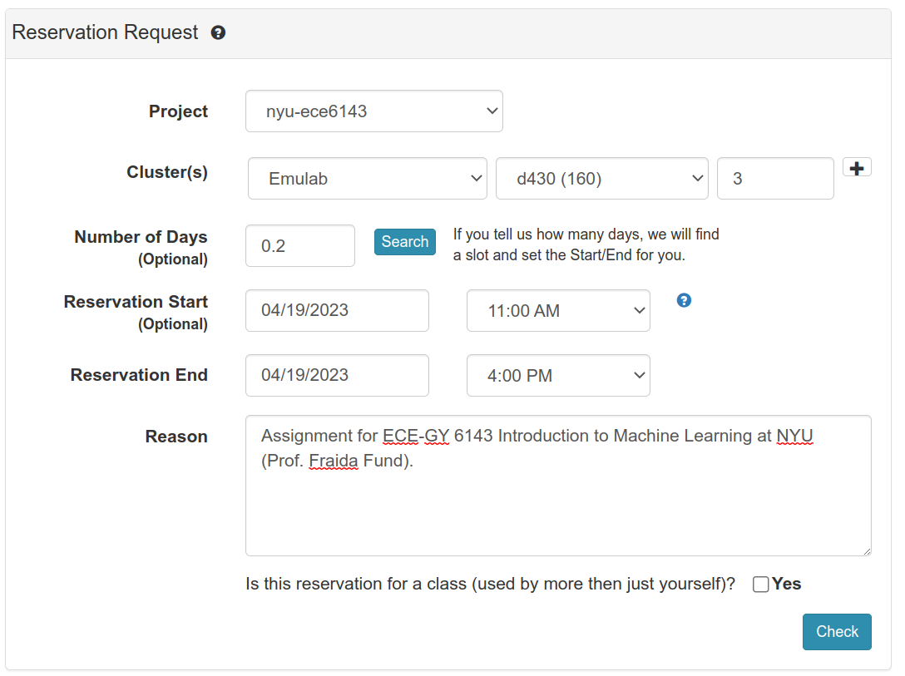
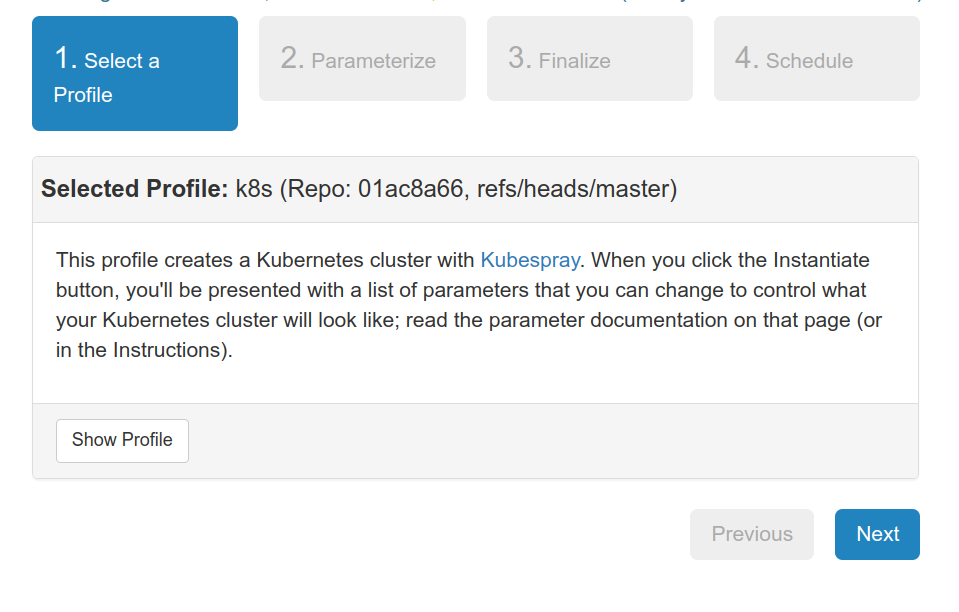
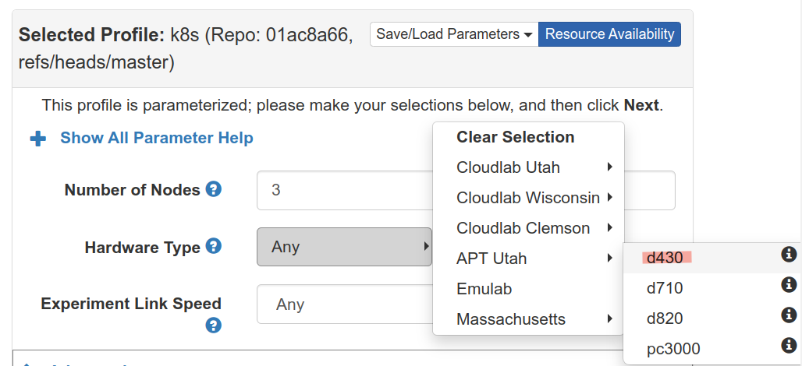
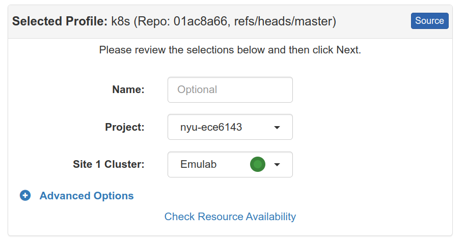
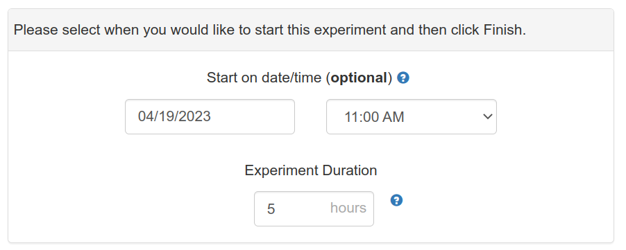
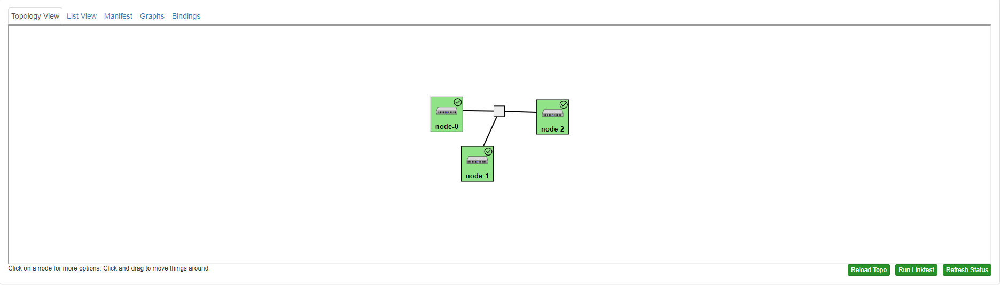
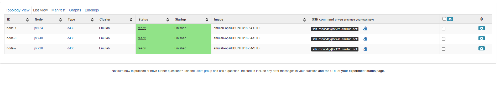

## Exercise : Set up your experiment on CloudLab

Before you run an experiment on CloudLab, you will:

- make an advance reservation for the resources you need. 
- "instantiate" an experiment with your reserved resources.
- wait for your resources to be configured. 
- log in to resources to carry out the experiment. 

This exercise will guide you through those steps.

### Reserve resources

This sequence of experiments will use multiple "bare metal" servers on the CloudLab testbed. Unlike virtual machines (which are more widely available on CloudLab and similar testbeds), "bare metal" servers are a scarce resource. Therefore:

* You will not "hold on" to resources for an extended period of time (days or weeks) - you will have resources only while you are actively working on them (hours) and then you will release them for others to use. If you have not finished your experiment, you will save all of your work on your own device so that you can continue at a later time with a "new" set of resources.
* You will reserve resources in advance, rather than trying to gain access to the resources you need "on demand". This way, you can be sure that the resources you require are available to you at the time that you have allocated to work on this experiment.
* If you reserve resources but do not use them during your reserved time, you may find that future reservations are denied. If you make excessive reservations, they are likely to be canceled. Therefore, you should plan your resource use very carefully.

You will reserve resources from the CloudLab web portal at [https://cloudlab.us/](https://cloudlab.us/). Log in to your CloudLab account, then click on **Experiments** at the top left corner. From the dropdown select **Reserve Nodes**.

Fill in the form as in the example below, to request 3 "bare metal" servers of type `d430`, but specify the 5-hour time interval in which *you* want to work on this assignment:



On the side of the page, there are a sequence of graphs showing the availability of different types of hardware resources on the various CloudLab facilities. You can scroll down to the Emulab resource availability plot to get a view of the availability of `d430` resources in the near future.

Once you have completed the form, click on **Check** which will verify if resources are expected to be available during the time you have selected. Then, a dialogue box will appear, in which you will select **Yes** and then **Submit** your reservation.

### Instantiate an experiment

Next, you will ask CloudLab to start an "instance" of an experiment on your reserved resources at the beginning of your reserved time.

On CloudLab, a "profile" defines the resources used in an experiment and a sequence of setup steps that will run on the resources when the experiment is "instantiated". This experiment uses the following profile : https://www.cloudlab.us/instantiate.php?profile=79d0f735-a099-11ea-b1eb-e4434b2381fc which creates and configures a small Kubernetes cluster on your resources.

When you open the profile from the link, you will see a brief description of the profile :



Click on **Next**. Now, you will be prompted to select parameters for our experiment. You should make the following selections:

* **Number of nodes**: 3
* **Hardware type**: Emulab > d430

as shown in the image below:



 Click on **Next** again. In the following section, select your project from the list, and select the Emulab cluster:




 Click on **Next** again. In the following section, specify the start time of your experiment - it should match the start time of your reservation - and the duration, which should similarly match your reservation:



Click **Finish**.

### Log in to resources

At the time that you specified in the previous section, CloudLab will attempt to "instantiate" your experiment on the resources that you have reserved. This means that it will:

* allocate three `d430` "bare metal" servers to the experiment
* configure network connectivity between them
* install your SSH keys on the servers
* run a sequence of scripts to execute and configure Kubernetes

This process will take close to 30 minutes.  While it is ongoing, you will receive an email with the subject line "Kubernetes Instance Setting Up". When it is complete, you will received an email with the subject line "Kubernetes Instance Setup Complete". This means that the resources are ready to use and you can login.  

When you visit your experiment page in the CloudLab portal, you will see that all three nodes are green (indicating that they are running) and have a tick on them (indicating that the sequence of startup scripts is complete), as shown.



If you click on **List view**, you will see SSH login details for each node, with a clipboard icon next to each SSH command that you can use to copy the SSH command. 



Open a terminal, and use it to SSH into the "node-0" node. (You may have to add an `-i` argument to the SSH command shown on the CloudLab portal, if your SSH key is not in the default location.)

Inside this SSH session, get a local copy of all the assignment materials:


``` shell
git clone https://github.com/teaching-on-testbeds/k8s-ml.git
```


Open a second terminal, and leave it logged in to your local shell. You will use this local terminal for SCP.
